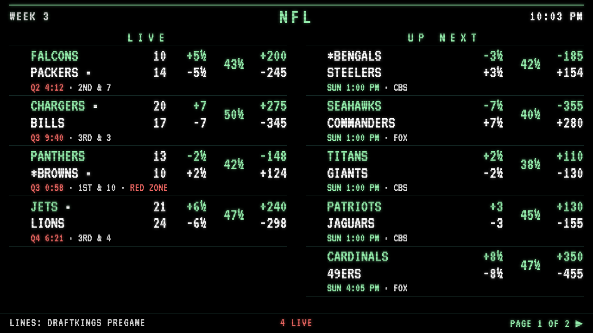
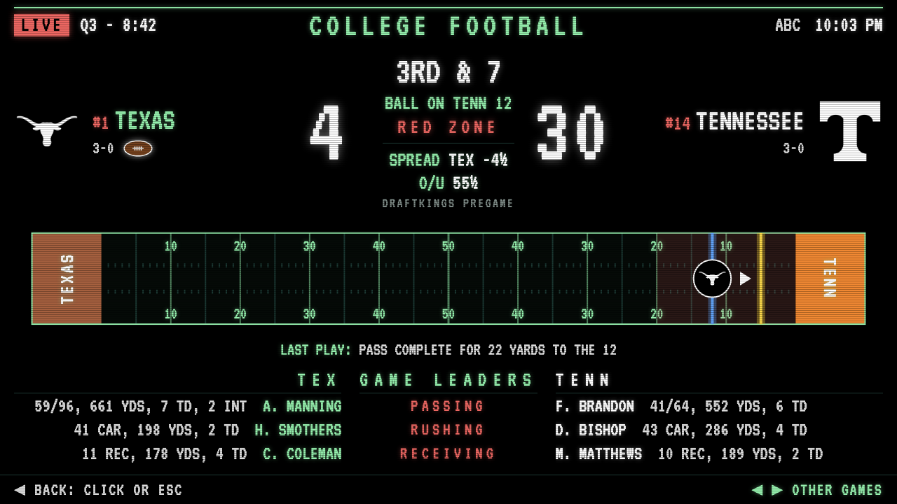
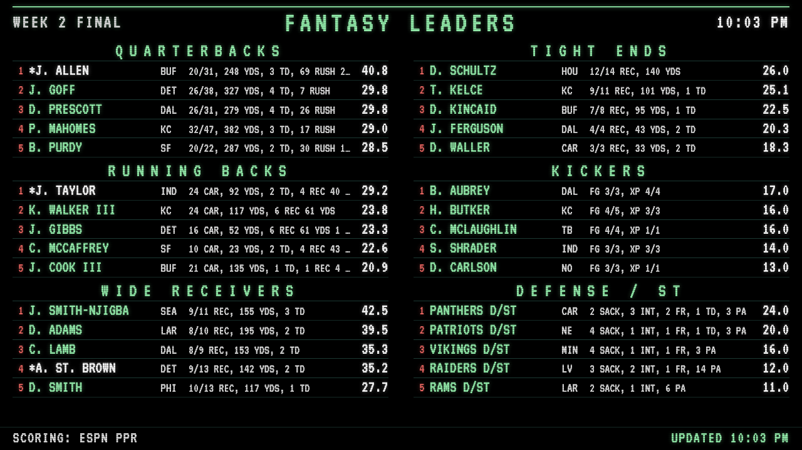
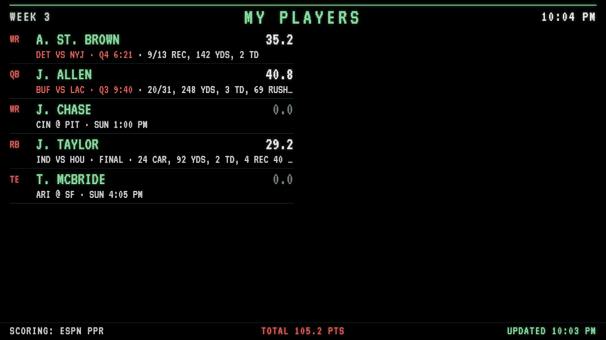
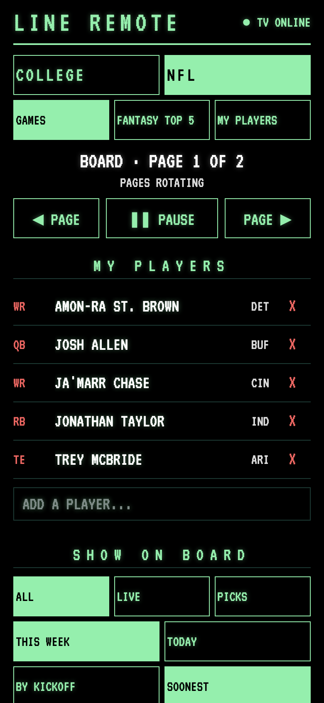

# Pi Line Board

A Las Vegas sportsbook–style line board for college football and the NFL, built to run all day on a Raspberry Pi plugged into an old TV. Live scores, spreads, totals and moneylines in glowing CRT green, a full-screen game view with a live field, NFL fantasy leaders, and a phone remote you open by scanning a QR code on the TV.



**Live demo:** [College football](https://joelwinner27.github.io/pi-scoreboard/LineBoard.html) · [NFL](https://joelwinner27.github.io/pi-scoreboard/LineBoard.html?league=nfl)
Shows real data from ESPN. Scores move on game days; the lines are there all week.

## Features

**The board**
- Scores, spread, total and moneyline for every game, with `½` and `EV` the way a sportsbook writes them
- College: FBS games only, sorted by AP ranking (#1 first), your teams pinned in a `* MY TEAMS *` section
- NFL: grouped by kickoff slot (`SUN 1:00 PM`, `SUN 4:25 PM`, …)
- Live games show quarter, clock, down & distance, possession and a red-zone flag
- Finals show who covered and whether the total went over, and flag upsets
- Filters for top 25, live only, one conference, or hand-picked games; sort by rank/kickoff or by soonest

**Game view** — click (or send from the phone) any game for a full-screen view: big score, pregame line, a live field with the line of scrimmage, first-down marker and the offense's logo, the last play, and each team's top passer, rusher and receiver.



**NFL fantasy** — the week's top 5 at every position (ESPN PPR), and a *My Players* screen for your own roster with live points and stat lines.

| Fantasy leaders | My players |
|---|---|
|  |  |

**Phone remote** — the TV shows a QR code for its first minute. Scan it to switch leagues, change filters, open a game, page through the board, pick fantasy players, or set your teams.



## How it works

```
 ESPN public APIs ──► LineBoard.html  (in the Pi's browser, full screen on the TV)
                          ▲    │
            settings,     │    │ what's on screen
            taps          │    ▼
                        server.py  (Python standard library, on the Pi)
                          ▲
                          │
                     remote.html  (your phone, same Wi-Fi)
```

- **`LineBoard.html`** is the whole board: one file of plain HTML, CSS and JavaScript, no build step or frameworks. It pulls scoreboards, game summaries and fantasy stats straight from ESPN, pages through games, and draws the field as SVG.
- **`server.py`** serves the board and the remote, stores the remote's settings, and passes taps to the board. It uses only Python's standard library.
- **`remote.html`** is the phone page.
- **`setup-pi.sh`** / **`start-board.sh`** set up the Pi to run everything on its own.

It's built to be left running:
- ESPN drops odds once a game ends, so the board remembers each pregame line to settle spreads and totals.
- Around midnight ESPN's feed can briefly come back empty while it rolls over. The board double-checks and keeps the last good data instead of going blank.
- The last good board is cached, so a reload during an outage comes back with games on screen.
- When ESPN's live data briefly drops the ball spot, the field falls back to its yard-line number, then to the last known spot.

## Run it

**Just the board:** open `LineBoard.html` in a browser. Add `?league=nfl` for the NFL.

**With the phone remote** (any computer with Python 3):
```
python3 server.py
```
Open `http://localhost:8080/` for the board; the remote's address and QR code appear on screen.

**On a Raspberry Pi:** copy the files into a folder on the Pi, then run once:
```
bash setup-pi.sh
sudo reboot
```
After that the Pi runs itself:
- `server.py` runs as a background service: it starts at boot and restarts if it ever stops.
- The board opens full screen at login (`start-board.sh`), with Chromium's background throttling turned off so it keeps updating.
- A watchdog restarts the browser if the board stops checking in for 5 minutes.
- Screen blanking is turned off.

No mouse on the TV? `bash hide-cursor.sh` hides the desktop's pointer too (undo with `bash hide-cursor.sh off`).

**Pushing updates from another computer:** create a `.deploy.env` file with your Pi's login:
```
PI="username@192.168.1.50"
DIR="Scorebug"
```
then run `./deploy.sh`. The TV reloads itself when a new board arrives, and the server restarts itself when `server.py` changes.

**Board options** (URL parameters, when not using the remote): `league=cfb|nfl`, `my=OSU,MICH`, `sec=20` (seconds per page), `cols=1`, `scope=today`, `sort=soon`, `top25=1`.

## Project history

`ScoreBugv1.html` is where this started: a simple multi-sport scorebug. The line board grew out of it.

## Notes

- Uses ESPN's public (unofficial) web APIs for scores, odds and fantasy stats. Not affiliated with ESPN or DraftKings; for personal use.
- Screenshots use sample game states.
